# 🏗️ Integration Platform — Tài liệu hệ thống

> **Phiên bản:** 2.1.0 · **Cập nhật:** 2026-05-21
> **Công nghệ:** .NET 8 · React · MSSQL · Redis · RabbitMQ · Docker · Kubernetes

---

## 📋 Mục lục

1. [Tổng quan hệ thống](#1-tổng-quan-hệ-thống)
2. [Kiến trúc & Công nghệ](#2-kiến-trúc--công-nghệ)
3. [Cấu trúc thư mục](#3-cấu-trúc-thư-mục)
4. [Triển khai hệ thống](#4-triển-khai-hệ-thống)
5. [Request chạy qua đâu?](#5-request-chạy-qua-đâu)
6. [Cơ sở dữ liệu](#6-cơ-sở-dữ-liệu)
7. [Cache — Redis](#7-cache--redis)
8. [Giám sát & Cảnh báo](#8-giám-sát--cảnh-báo)
9. [CI/CD — Tự động hóa triển khai](#9-cicd--tự-động-hóa-triển-khai)
10. [Xử lý sự cố & Phục hồi](#10-xử-lý-sự-cố--phục-hồi)
11. [Mở rộng hệ thống](#11-mở-rộng-hệ-thống)
12. [Bảo mật](#12-bảo-mật)
13. [Disaster Recovery](#13-disaster-recovery)
14. [Runbook vận hành](#14-runbook-vận-hành)

---

## 1. Tổng quan hệ thống

### Hệ thống này làm gì?

**Integration Platform** là một **cầu nối trung gian** giữa các ứng dụng nội bộ và các đối tác bên ngoài (ngân hàng, ví điện tử, KYC, SMS...).

Thay vì mỗi ứng dụng phải tự kết nối trực tiếp với từng đối tác — với các format, xác thực và giao thức khác nhau — tất cả đều đi qua một điểm duy nhất là **Integration Platform**.

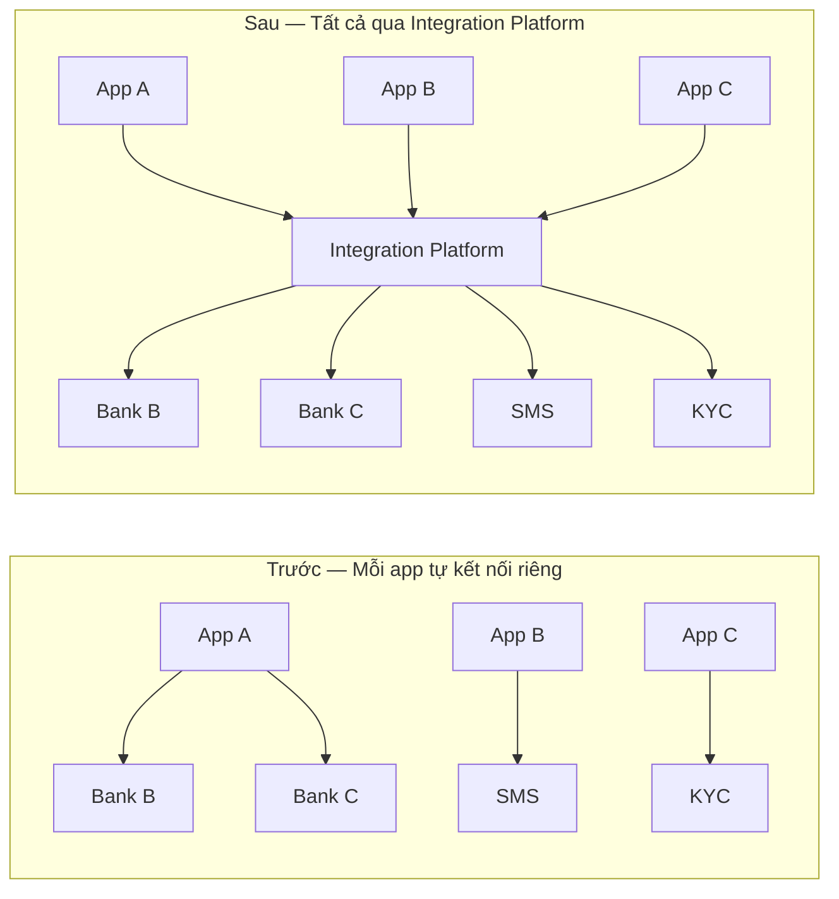
```mermaid
flowchart LR
    subgraph BEFORE["Trước — Mỗi app tự kết nối riêng"]
        direction TB
        A1["App A"] --> B1["Bank B"]
        A1 --> B2["Bank C"]
        A2["App B"] --> B3["SMS"]
        A3["App C"] --> B4["KYC"]
    end

    subgraph AFTER["Sau — Tất cả qua Integration Platform"]
        direction TB
        C1["App A"]
        C2["App B"]
        C3["App C"]
        IP["Integration Platform"]
        D1["Bank B"]
        D2["Bank C"]
        D3["SMS"]
        D4["KYC"]
        C1 & C2 & C3 --> IP
        IP --> D1 & D2 & D3 & D4
    end
```

### Sơ đồ tổng quan toàn hệ thống

> Sơ đồ bên dưới thể hiện toàn bộ hệ thống: từ source code → CI/CD build → Kubernetes deploy → HA/Load balancing → kết nối đối tác → giám sát.

<img src="" alt="System Overview" width="100%" style="max-width:1100px"/>

**Đọc sơ đồ theo 5 bước:**

| Bước | Nội dung |
|---|---|
| **① Develop** | Developer viết code trong các thư mục `gateway/`, `integration-service/`, `admin-ui/`... |
| **② Build & Test** | GitHub Actions tự động: `dotnet build` → `dotnet test` → `docker build` → push image lên `ghcr.io` |
| **③ Deploy trên K8s** | `kubectl apply` triển khai lên Kubernetes — mỗi service chạy nhiều Pod, HPA tự scale theo CPU/RAM |
| **④ Kết nối Đối tác** | Integration Service dùng Connector Plugin (Generic HTTP hoặc DLL) để gọi Bank, E-Wallet, KYC, SMS |
| **⑤ Giám sát** | Prometheus scrape `/metrics` → Grafana vẽ biểu đồ → cảnh báo qua Telegram khi vượt ngưỡng |

**Load Balancing giữa các service:**
- **Ingress → Gateway pods**: round-robin qua nhiều Gateway pod (min 2, max 5)
- **Gateway → Integration Service**: K8s ClusterIP Service phân phối đều sang 2–10 pod
- **Integration Service pods** dùng chung Redis (idempotency) và MSSQL (connection pool) nên hoàn toàn stateless — có thể scale tự do

**High Availability (HA):**
- Mỗi service có `liveness probe` + `readiness probe` — pod lỗi bị tự restart và loại khỏi load balancer
- Rolling update: pod mới lên healthy trước, pod cũ mới bị xóa — không có downtime
- `kubectl rollout undo` rollback trong vài giây nếu deploy lỗi

---

## 2. Kiến trúc & Công nghệ

### Hệ thống dùng những gì?

| Phần | Công nghệ | Dùng để làm gì |
|---|---|---|
| Giao diện quản trị | React 18 + Vite | Màn hình quản lý cấu hình, xem log |
| Cổng vào (Gateway) | .NET 8 + YARP | Kiểm tra đăng nhập, điều hướng request |
| Service xử lý | .NET 8 | Logic nghiệp vụ và tích hợp đối tác |
| Cơ sở dữ liệu | MSSQL Server 2022 | Lưu log, cấu hình kết nối |
| Cache | Redis 7 | Lưu tạm cấu hình, chống trùng lặp |
| Hàng đợi | RabbitMQ 3 | Xử lý bất đồng bộ |
| Giám sát | Prometheus + Grafana | Biểu đồ, cảnh báo |
| Tracing | Jaeger | Theo dõi request đi qua những đâu |
| Log | Serilog + Seq | Tìm kiếm log có cấu trúc |
| Container | Docker + Docker Compose | Đóng gói và chạy service |
| Triển khai sản xuất | Kubernetes | Tự động scale, tự phục hồi |
| CI/CD | GitHub Actions | Tự động build, test, deploy |

### Tại sao chỉ cần 1 URL mà gọi được nhiều đối tác khác nhau?

> 💡 **Đây là câu hỏi quan trọng nhất khi mới vào dự án.**

**Vấn đề cần giải quyết:** Bank B dùng API REST + HMAC auth, Bank C dùng SOAP + Basic auth, Bank E có SDK riêng — không thể code cứng từng cái.

**Giải pháp:** Mỗi đối tác có một file cấu hình JSON (`ConnectorConfig`). Khi gọi API, client chỉ cần gửi kèm `connectorConfigId` — hệ thống sẽ tự tìm đúng cấu hình và kết nối đúng đối tác.

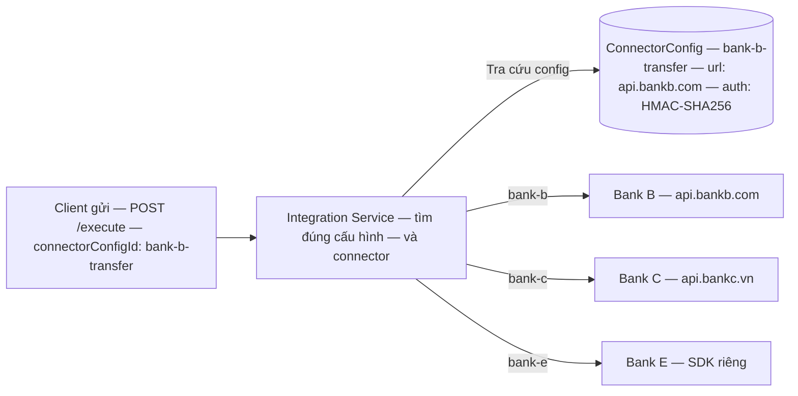
```mermaid
flowchart LR
    A["Client gửi — POST /execute — connectorConfigId: bank-b-transfer"]
    B[("ConnectorConfig — bank-b-transfer — url: api.bankb.com — auth: HMAC-SHA256")]
    C["Integration Service — tìm đúng cấu hình — và connector"]
    D1["Bank B — api.bankb.com"]
    D2["Bank C — api.bankc.vn"]
    D3["Bank E — SDK riêng"]

    A --> C
    C -->|"Tra cứu config"| B
    C -->|"bank-b"| D1
    C -->|"bank-c"| D2
    C -->|"bank-e"| D3
```

**Kết quả:** Thêm đối tác mới = thêm 1 file JSON cấu hình + (nếu cần) 1 file DLL plugin. Không cần sửa code lõi, không cần deploy lại service.

### Sơ đồ các lớp bên trong

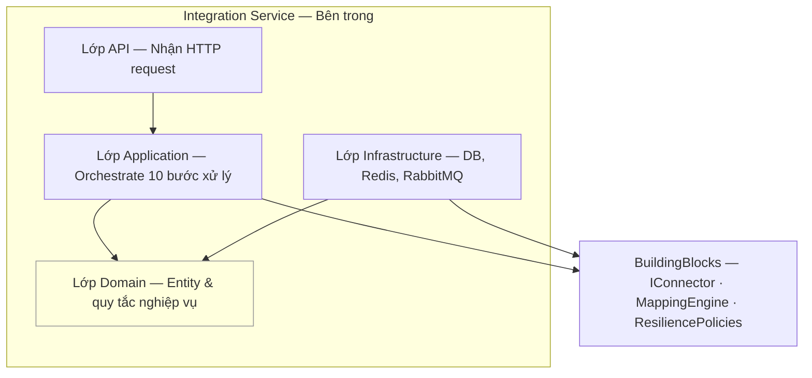
```mermaid
graph TD
    subgraph SVC["Integration Service — Bên trong"]
        A["Lớp API — Nhận HTTP request"]
        B["Lớp Application — Orchestrate 10 bước xử lý"]
        C["Lớp Domain — Entity & quy tắc nghiệp vụ"]
        D["Lớp Infrastructure — DB, Redis, RabbitMQ"]
    end

    E["BuildingBlocks — IConnector · MappingEngine · ResiliencePolicies"]

    A --> B --> C
    D --> C
    B & D --> E

    style C fill:#ffd,stroke:#999
```

> **Lưu ý:** Mũi tên chỉ hướng phụ thuộc. Lớp Domain ở giữa không phụ thuộc vào lớp nào — đây là nguyên tắc Clean Architecture giúp dễ test và dễ thay thế thành phần.

---

## 3. Cấu trúc thư mục

### Nhìn vào thư mục, hiểu ngay vai trò từng phần

```
integration-platform/
│
├── 🎨 admin-ui/              ← Giao diện quản trị (React)
│   ├── src/pages/            ← Các màn hình: Dashboard, Danh sách tích hợp...
│   ├── src/components/       ← Các thành phần giao diện tái sử dụng
│   └── Dockerfile
│
├── 🔀 gateway/               ← Cổng vào duy nhất (API Gateway)
│   └── Gateway.Api/          ← Kiểm tra JWT, giới hạn tốc độ, điều hướng
│
├── 🔌 integration-service/   ← ★ Tim của hệ thống
│   ├── IntegrationService.Api/
│   │   ├── configs/          ← File JSON cấu hình kết nối đối tác
│   │   └── plugins/          ← File DLL connector tùy chỉnh
│   ├── IntegrationService.Application/   ← Logic xử lý 10 bước
│   ├── IntegrationService.Domain/        ← Các entity cốt lõi
│   └── IntegrationService.Infrastructure/ ← Kết nối DB, Redis, RabbitMQ
│
├── 📋 config-service/        ← Quản lý cấu hình kết nối đối tác
├── 💼 business-service/      ← Xử lý nghiệp vụ (thanh toán, chuyển tiền...)
├── 📡 websocket-service/     ← Đẩy thông báo real-time
│
├── 🔧 connectors/            ← Các connector tùy chỉnh cho từng đối tác
│   ├── Connector.BankE/      ← Connector riêng cho Bank E
│   └── Connector.SampleBank/ ← Connector mẫu để tham khảo
│
├── 📦 building-blocks/       ← Thư viện dùng chung cho tất cả service
│   ├── BuildingBlocks.Abstractions/  ← Interface, model chung
│   └── BuildingBlocks.Core/          ← Implement: Resilience, Mapping...
│
├── 🗄️ database/migrations/   ← Script tạo/nâng cấp database
│
└── 🏗️ infrastructure/
    ├── docker/               ← File Docker Compose
    ├── k8s/                  ← File cấu hình Kubernetes
    └── observability/        ← Cấu hình Prometheus
```

### Mỗi service làm gì?

| Service | Trách nhiệm chính |
|---|---|
| **API Gateway** | Cổng vào duy nhất — kiểm tra đăng nhập, điều hướng đến đúng service |
| **Integration Service** | Nhận yêu cầu tích hợp, tải cấu hình, gọi đối tác, trả kết quả |
| **Config Service** | Lưu và cung cấp cấu hình kết nối các đối tác (có cache Redis) |
| **Business Service** | Xử lý nghiệp vụ, gọi Integration Service khi cần kết nối đối tác |
| **WebSocket Service** | Nhận sự kiện từ hàng đợi, đẩy thông báo real-time cho client |
| **Admin UI** | Giao diện quản trị để cấu hình connector, xem log thực thi |

---

## 4. Triển khai hệ thống

### Có mấy môi trường?

| Môi trường | Cách chạy | Mục đích |
|---|---|---|
| **Local (máy dev)** | `docker compose -f docker-compose.dev.yml up` | Phát triển, debug |
| **Dev** | Chạy infra bằng Docker, service bằng IDE | Test tính năng mới |
| **Staging** | GitHub Actions tự deploy | Kiểm tra trước khi lên prod |
| **Production** | Kubernetes | Chạy thật, tự scale, tự phục hồi |

### Sơ đồ triển khai — Docker Compose (Local/Staging)

> Tất cả chạy trên 1 máy, giao tiếp qua Docker network nội bộ.

```mermaid
graph TD
    subgraph HOST["🖥️ Máy chủ — Docker Bridge Network"]

        subgraph EDGE2["Lớp tiếp nhận"]
            C_UI["Admin UI — nginx :3000"]
            C_GW["API Gateway :5000"]
        end

        subgraph APP2["Các service xử lý"]
            C_IS["Integration Service :5001"]
            C_CS["Config Service :5002"]
            C_BS["Business Service :5003"]
            C_WS["WebSocket Service :5004"]
        end

        subgraph INFRA2["Hạ tầng"]
            C_SQL["MSSQL :1433 — Volume: sqlserver-data"]
            C_RED["Redis :6380 — Volume: redis-data"]
            C_MQ["RabbitMQ :5672 — Volume: rabbitmq-data"]
        end

        subgraph OBS2["Giám sát"]
            C_PR["Prometheus :9090"]
            C_GR["Grafana :3001"]
            C_JA["Jaeger :16686"]
        end
            C_JA["Jaeger cổng 16686"]
        end
    end

    C_UI -->|"Proxy /api → cổng 8080"| C_GW
    C_GW --> C_IS & C_CS & C_BS
    C_IS --> C_SQL & C_RED & C_MQ
    C_CS --> C_SQL & C_RED
    C_BS --> C_IS
    C_WS --> C_MQ
    C_IS & C_CS & C_BS & C_GW -->|"Số liệu"| C_PR
    C_PR --> C_GR
```

### Sơ đồ khởi động — Service nào chờ service nào?

> Khi chạy `docker compose up`, các container khởi động theo đúng thứ tự này để tránh lỗi kết nối.

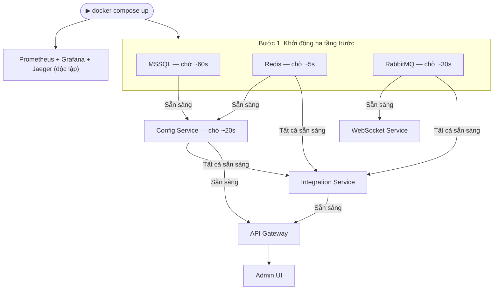
```mermaid
flowchart TD
    START(["▶ docker compose up"]) --> INFRA_START

    subgraph INFRA_START["Bước 1: Khởi động hạ tầng trước"]
        SQL_UP["MSSQL — chờ ~60s"]
        RED_UP["Redis — chờ ~5s"]
        MQ_UP["RabbitMQ — chờ ~30s"]
    end

    SQL_UP & RED_UP -->|"Sẵn sàng"| CS_UP["Config Service — chờ ~20s"]
    MQ_UP -->|"Sẵn sàng"| WS_UP["WebSocket Service"]

    CS_UP & RED_UP & MQ_UP -->|"Tất cả sẵn sàng"| IS_UP["Integration Service"]
    IS_UP & CS_UP -->|"Sẵn sàng"| GW_UP["API Gateway"]
    GW_UP --> UI_UP["Admin UI"]
    START --> OBS_UP["Prometheus + Grafana + Jaeger (độc lập)"]
```

### Sơ đồ triển khai — Kubernetes (Production)

> Môi trường production dùng Kubernetes: tự scale, tự phục hồi khi pod lỗi.

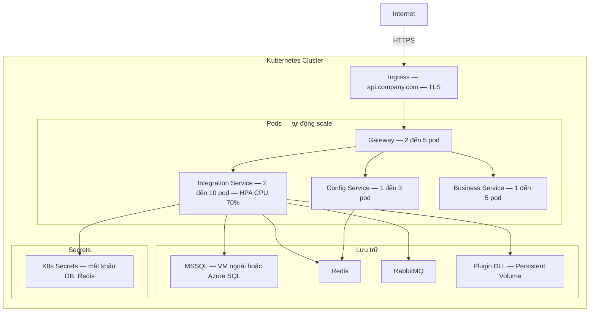
```mermaid
graph TD
    INTERNET["Internet"] -->|"HTTPS"| ING

    subgraph K8S["Kubernetes Cluster"]
        ING["Ingress — api.company.com — TLS"]

        subgraph PODS["Pods — tự động scale"]
            GW_P["Gateway — 2 đến 5 pod"]
            IS_P["Integration Service — 2 đến 10 pod — HPA CPU 70%"]
            CS_P["Config Service — 1 đến 3 pod"]
            BS_P["Business Service — 1 đến 5 pod"]
        end

        subgraph STATE["Lưu trữ"]
            K_SQL["MSSQL — VM ngoài hoặc Azure SQL"]
            K_RED["Redis"]
            K_MQ["RabbitMQ"]
            K_PVC["Plugin DLL — Persistent Volume"]
        end

        subgraph SECRET["Secrets"]
            K_SEC["K8s Secrets — mật khẩu DB, Redis"]
        end
    end

    ING --> GW_P --> IS_P & CS_P & BS_P
    IS_P --> K_SQL & K_RED & K_MQ & K_PVC & K_SEC
    CS_P --> K_RED
```

### Triển khai trên nhiều máy chủ riêng (không dùng K8s)

> Nếu không có Kubernetes, các service có thể chạy trên nhiều máy chủ riêng biệt. Chỉ cần đổi biến môi trường để trỏ đúng địa chỉ.

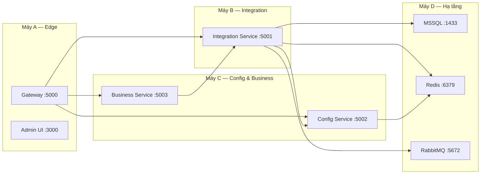
```mermaid
graph LR
    subgraph SA["Máy A — Edge"]
        G["Gateway :5000"]
        U["Admin UI :3000"]
    end
    subgraph SB["Máy B — Integration"]
        I["Integration Service :5001"]
    end
    subgraph SC["Máy C — Config & Business"]
        C["Config Service :5002"]
        B["Business Service :5003"]
    end
    subgraph SD["Máy D — Hạ tầng"]
        DB["MSSQL :1433"]
        RD["Redis :6379"]
        MQ2["RabbitMQ :5672"]
    end

    G --> I & C & B
    I --> C
    I --> DB & RD & MQ2
    B --> I
    C --> RD
```

> **💡 Chỉ cần thay 3 biến môi trường — không sửa code:**
> ```
> # Trên Máy B (Integration Service)
> Services__ConfigService=http://may-c:5002
>
> # Trên Máy A (Gateway)
> ReverseProxy__Clusters__integration-cluster__Destinations__d1__Address=http://may-b:5001
> ReverseProxy__Clusters__config-cluster__Destinations__d1__Address=http://may-c:5002
> ```

---

## 5. Request chạy qua đâu?

> Hệ thống hỗ trợ **2 chiều tích hợp** — Outbound (gọi ra đối tác) và Inbound (đối tác gọi vào).

---

### Flow 1 — Outbound: App nội bộ gọi ra đối tác

**Kịch bản:** Business Service cần thanh toán qua MoMo, chuyển tiền qua Bank B, gửi SMS...


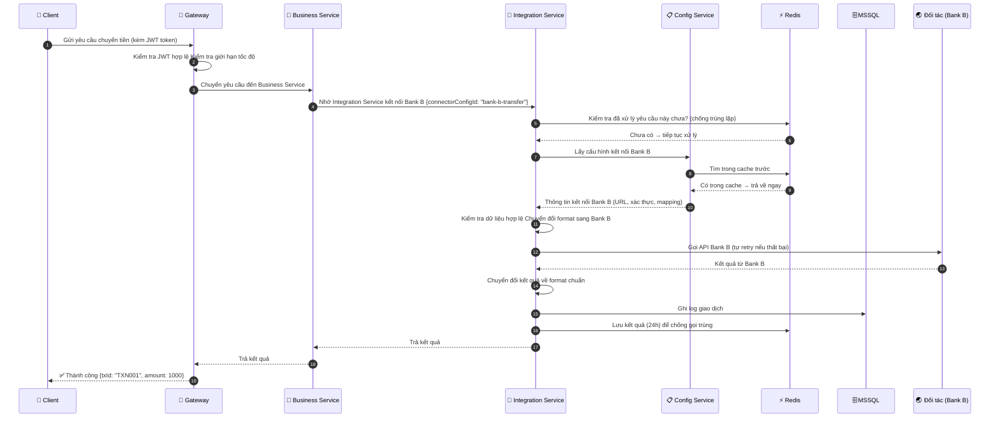
```mermaid
sequenceDiagram
    autonumber
    participant KH as 👤 Client
    participant GW as 🔀 Gateway
    participant BS as 💼 Business Service
    participant IS as 🔌 Integration Service
    participant CS as 📋 Config Service
    participant RD as ⚡ Redis
    participant DB as 🗄️ MSSQL
    participant TP as 🌏 Đối tác (Bank B)

    KH->>GW: Gửi yêu cầu chuyển tiền (kèm JWT token)

    GW->>GW: Kiểm tra JWT hợp lệ Kiểm tra giới hạn tốc độ
    GW->>BS: Chuyển yêu cầu đến Business Service

    BS->>IS: Nhờ Integration Service kết nối Bank B {connectorConfigId: "bank-b-transfer"}

    IS->>RD: Kiểm tra đã xử lý yêu cầu này chưa? (chống trùng lặp)
    RD-->>IS: Chưa có → tiếp tục xử lý

    IS->>CS: Lấy cấu hình kết nối Bank B
    CS->>RD: Tìm trong cache trước
    RD-->>CS: Có trong cache → trả về ngay
    CS-->>IS: Thông tin kết nối Bank B (URL, xác thực, mapping)

    IS->>IS: Kiểm tra dữ liệu hợp lệ Chuyển đổi format sang Bank B
    IS->>TP: Gọi API Bank B (tự retry nếu thất bại)
    TP-->>IS: Kết quả từ Bank B

    IS->>IS: Chuyển đổi kết quả về format chuẩn
    IS->>DB: Ghi log giao dịch
    IS->>RD: Lưu kết quả (24h) để chống gọi trùng

    IS-->>BS: Trả kết quả
    BS-->>GW: Trả kết quả
    GW-->>KH: ✅ Thành công {txId: "TXN001", amount: 1000}
```

### 10 bước xử lý bên trong Integration Service

> Mỗi yêu cầu đi qua 10 bước này theo thứ tự. Bước nào thất bại thì trả lỗi ngay, không đi tiếp.

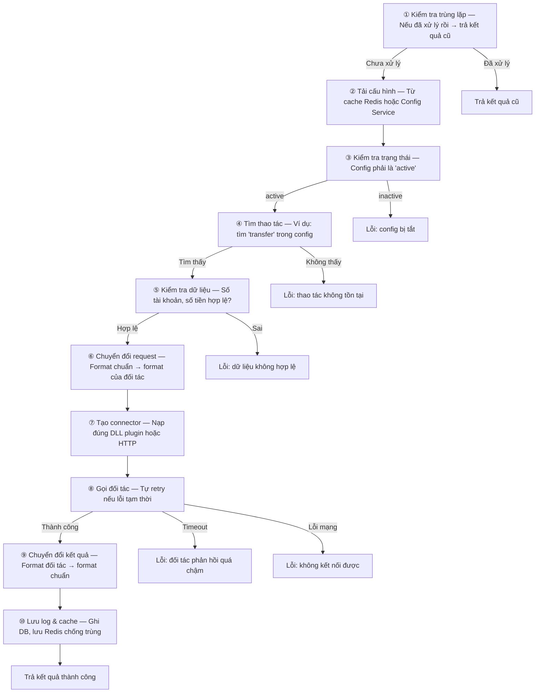
```mermaid
flowchart TD
    B1["① Kiểm tra trùng lặp — Nếu đã xử lý rồi → trả kết quả cũ"]
    B2["② Tải cấu hình — Từ cache Redis hoặc Config Service"]
    B3["③ Kiểm tra trạng thái — Config phải là 'active'"]
    B4["④ Tìm thao tác — Ví dụ: tìm 'transfer' trong config"]
    B5["⑤ Kiểm tra dữ liệu — Số tài khoản, số tiền hợp lệ?"]
    B6["⑥ Chuyển đổi request — Format chuẩn → format của đối tác"]
    B7["⑦ Tạo connector — Nạp đúng DLL plugin hoặc HTTP"]
    B8["⑧ Gọi đối tác — Tự retry nếu lỗi tạm thời"]
    B9["⑨ Chuyển đổi kết quả — Format đối tác → format chuẩn"]
    B10["⑩ Lưu log & cache — Ghi DB, lưu Redis chống trùng"]

    B1 -->|"Chưa xử lý"| B2
    B1 -->|"Đã xử lý"| CACHE["Trả kết quả cũ"]
    B2 --> B3
    B3 -->|"active"| B4
    B3 -->|"inactive"| ERR1["Lỗi: config bị tắt"]
    B4 -->|"Tìm thấy"| B5
    B4 -->|"Không thấy"| ERR2["Lỗi: thao tác không tồn tại"]
    B5 -->|"Hợp lệ"| B6
    B5 -->|"Sai"| ERR3["Lỗi: dữ liệu không hợp lệ"]
    B6 --> B7 --> B8
    B8 -->|"Thành công"| B9
    B8 -->|"Timeout"| ERR4["Lỗi: đối tác phản hồi quá chậm"]
    B8 -->|"Lỗi mạng"| ERR5["Lỗi: không kết nối được"]
    B9 --> B10 --> DONE["Trả kết quả thành công"]
```

### Sơ đồ xử lý bất đồng bộ (Async)

> Một số thao tác không cần chờ kết quả ngay — ví dụ gửi SMS, thông báo hàng loạt. Luồng này dùng hàng đợi tin nhắn.

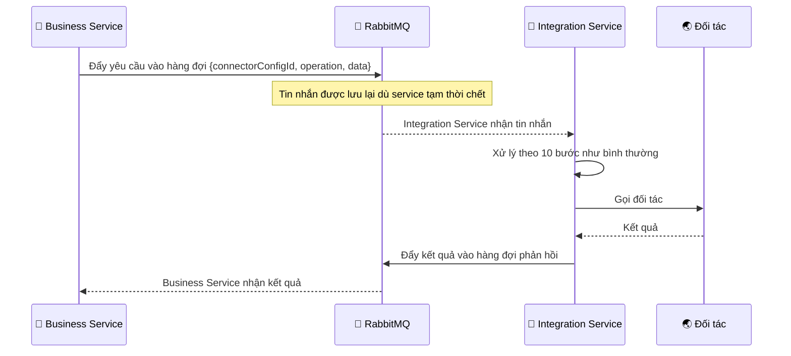
```mermaid
sequenceDiagram
    participant BS as 💼 Business Service
    participant MQ as 🐇 RabbitMQ
    participant IS as 🔌 Integration Service
    participant TP as 🌏 Đối tác

    BS->>MQ: Đẩy yêu cầu vào hàng đợi {connectorConfigId, operation, data}
    note over MQ: Tin nhắn được lưu lại dù service tạm thời chết

    MQ-->>IS: Integration Service nhận tin nhắn
    IS->>IS: Xử lý theo 10 bước như bình thường
    IS->>TP: Gọi đối tác
    TP-->>IS: Kết quả
    IS->>MQ: Đẩy kết quả vào hàng đợi phản hồi
    MQ-->>BS: Business Service nhận kết quả
```

**Khi nào dùng async?**
- Gửi SMS hàng loạt
- Thông báo đến nhiều người dùng
- Các thao tác không cần kết quả tức thì
- Khi đối tác có thể chậm và không muốn client chờ

---

### Flow 2 — Inbound: Đối tác gọi vào App nội bộ

**Kịch bản:** Bank B gửi notification khi giao dịch hoàn tất, MoMo gửi callback sau khi thanh toán, KYC service trả kết quả định danh...

**Endpoint nhận webhook:**
```
POST /api/v1/webhook/{connectorConfigId}/{operation}

Ví dụ:
  POST /api/v1/webhook/bank-b-transfer/transfer-notification
  POST /api/v1/webhook/ewallet-momo/payment-callback
  POST /api/v1/webhook/kyc-service/verification-result
```

> **Lưu ý bảo mật:** Endpoint webhook không yêu cầu JWT. Xác thực bằng HMAC signature — Integration Service kiểm tra chữ ký trước khi xử lý.

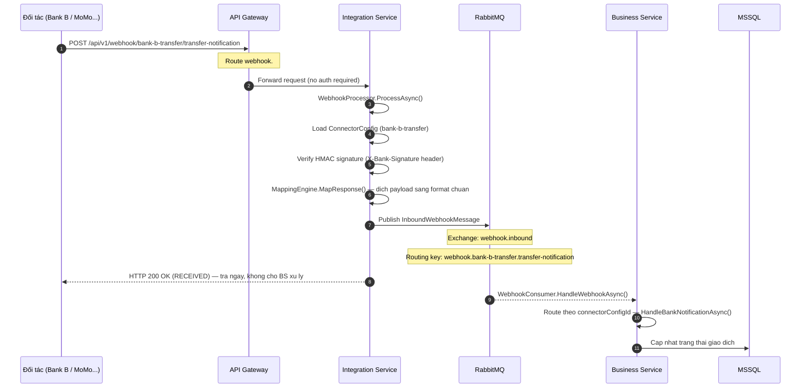
```mermaid
sequenceDiagram
    autonumber
    participant TP as Đối tác (Bank B / MoMo...)
    participant GW as API Gateway
    participant IS as Integration Service
    participant MQ as RabbitMQ
    participant BS as Business Service
    participant DB as MSSQL

    TP->>GW: POST /api/v1/webhook/bank-b-transfer/transfer-notification
    note over GW: Route webhook.# — bypass JWT
    GW->>IS: Forward request (no auth required)

    IS->>IS: WebhookProcessor.ProcessAsync()
    IS->>IS: Load ConnectorConfig (bank-b-transfer)
    IS->>IS: Verify HMAC signature (X-Bank-Signature header)
    IS->>IS: MappingEngine.MapResponse() — dich payload sang format chuan

    IS->>MQ: Publish InboundWebhookMessage
    note over MQ: Exchange: webhook.inbound
    note over MQ: Routing key: webhook.bank-b-transfer.transfer-notification

    IS-->>TP: HTTP 200 OK (RECEIVED) — tra ngay, khong cho BS xu ly

    MQ-->>BS: WebhookConsumer.HandleWebhookAsync()
    BS->>BS: Route theo connectorConfigId — HandleBankNotificationAsync()
    BS->>DB: Cap nhat trang thai giao dich
```

**Luồng dữ liệu chi tiết:**

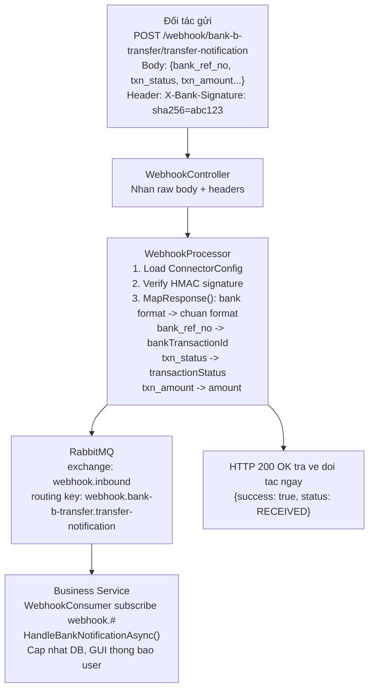
```mermaid
flowchart TD
    A["Đối tác gửi\nPOST /webhook/bank-b-transfer/transfer-notification\nBody: {bank_ref_no, txn_status, txn_amount...}\nHeader: X-Bank-Signature: sha256=abc123"] --> B["WebhookController\nNhan raw body + headers"]

    B --> C["WebhookProcessor\n1. Load ConnectorConfig\n2. Verify HMAC signature\n3. MapResponse(): bank format -> chuan format\n   bank_ref_no -> bankTransactionId\n   txn_status -> transactionStatus\n   txn_amount -> amount"]

    C --> D["RabbitMQ\nexchange: webhook.inbound\nrouting key: webhook.bank-b-transfer.transfer-notification"]

    D --> E["Business Service\nWebhookConsumer subscribe webhook.#\nHandleBankNotificationAsync()\nCap nhat DB, GUI thong bao user"]

    C --> F["HTTP 200 OK tra ve doi tac ngay\n{success: true, status: RECEIVED}"]
```

**File mới được thêm:**

| File | Vai trò |
|---|---|
| `IntegrationService.Application/Services/WebhookProcessor.cs` | Xử lý webhook: verify signature, map payload, publish MQ |
| `IntegrationService.Api/Controllers/WebhookController.cs` | Endpoint nhận HTTP POST từ đối tác |
| `BusinessService.Infrastructure/Messaging/WebhookConsumer.cs` | Consumer phía app nội bộ, nhận webhook từ RabbitMQ |
| `configs/bank-b-webhook.json` | Config mẫu với field `transfer-notification` operation và `WebhookSecret` |
| `BuildingBlocks.Abstractions/Messaging/WebhookMessage.cs` | Model `InboundWebhookMessage` dùng chung |

**Cấu hình webhook secret trong connector config:**

```json
"authentication": {
  "type": "ApiKey",
  "parameters": {
    "HeaderName": "X-Api-Key",
    "ApiKey": "bank-b-key",
    "WebhookSecret": "bank-b-webhook-secret",
    "SignatureHeader": "X-Bank-Signature"
  }
}
```

**Cấu hình operation inbound trong connector config:**

```json
{
  "name": "transfer-notification",
  "responseMappings": [
    { "source": "bank_ref_no",    "target": "bankTransactionId" },
    { "source": "txn_status",     "target": "transactionStatus" },
    { "source": "txn_amount",     "target": "amount" },
    { "source": "partner_ref_no", "target": "referenceId" }
  ]
}
```

> `responseMappings` được tái dụng cho chiều inbound — dịch format của đối tác sang format chuẩn của hệ thống.

---

## 6. Cơ sở dữ liệu

### Cấu trúc tổng quan

> Mỗi service quản lý database của riêng mình — không service nào được đọc thẳng DB của service khác.

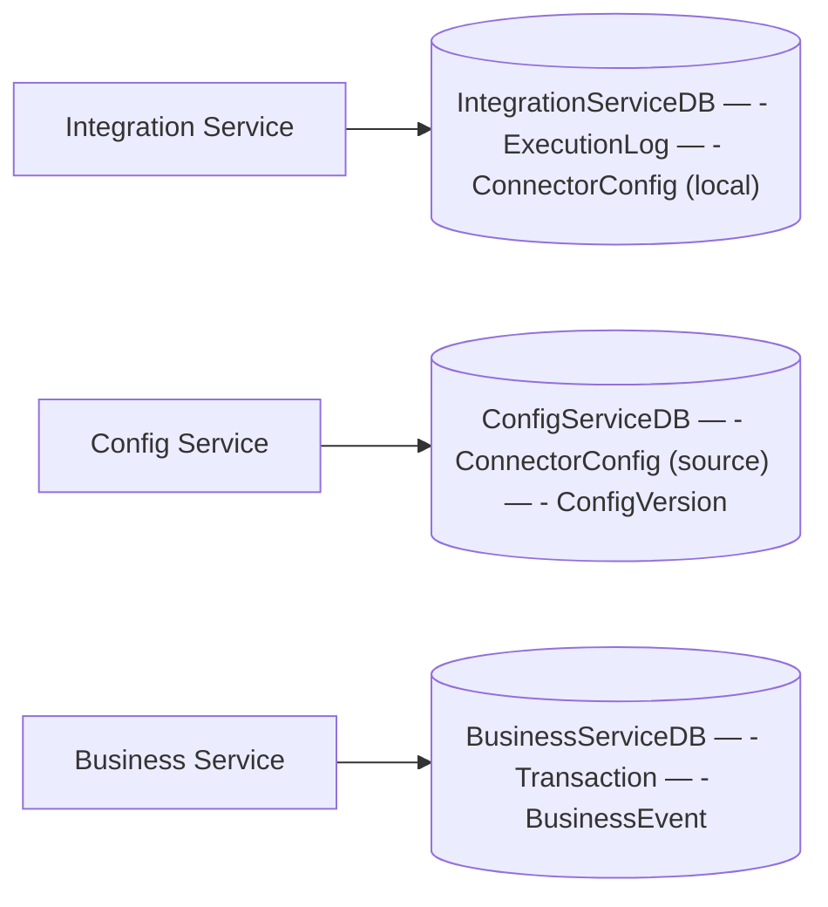
```mermaid
graph LR
    IS["Integration Service"] --> ISDB[("IntegrationServiceDB — - ExecutionLog — - ConnectorConfig (local)")]
    CS["Config Service"] --> CSDB[("ConfigServiceDB — - ConnectorConfig (source) — - ConfigVersion")]
    BS["Business Service"] --> BSDB[("BusinessServiceDB — - Transaction — - BusinessEvent")]
```

### Các bảng quan trọng

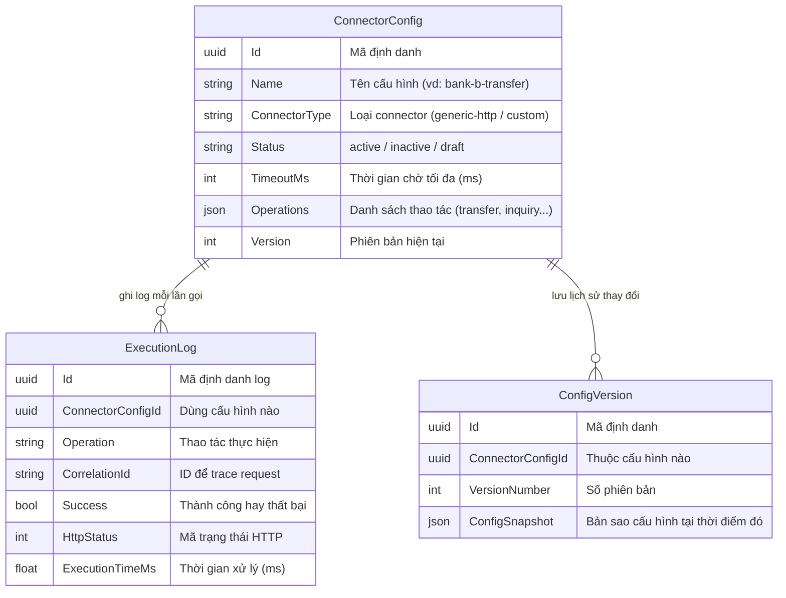
```mermaid
erDiagram
    ConnectorConfig {
        uuid    Id           "Mã định danh"
        string  Name         "Tên cấu hình (vd: bank-b-transfer)"
        string  ConnectorType "Loại connector (generic-http / custom)"
        string  Status       "active / inactive / draft"
        int     TimeoutMs    "Thời gian chờ tối đa (ms)"
        json    Operations   "Danh sách thao tác (transfer, inquiry...)"
        int     Version      "Phiên bản hiện tại"
    }

    ExecutionLog {
        uuid    Id            "Mã định danh log"
        uuid    ConnectorConfigId "Dùng cấu hình nào"
        string  Operation     "Thao tác thực hiện"
        string  CorrelationId "ID để trace request"
        bool    Success       "Thành công hay thất bại"
        int     HttpStatus    "Mã trạng thái HTTP"
        float   ExecutionTimeMs "Thời gian xử lý (ms)"
    }

    ConfigVersion {
        uuid    Id            "Mã định danh"
        uuid    ConnectorConfigId "Thuộc cấu hình nào"
        int     VersionNumber "Số phiên bản"
        json    ConfigSnapshot "Bản sao cấu hình tại thời điểm đó"
    }

    ConnectorConfig ||--o{ ExecutionLog : "ghi log mỗi lần gọi"
    ConnectorConfig ||--o{ ConfigVersion : "lưu lịch sử thay đổi"
```

### Luồng kết nối Database

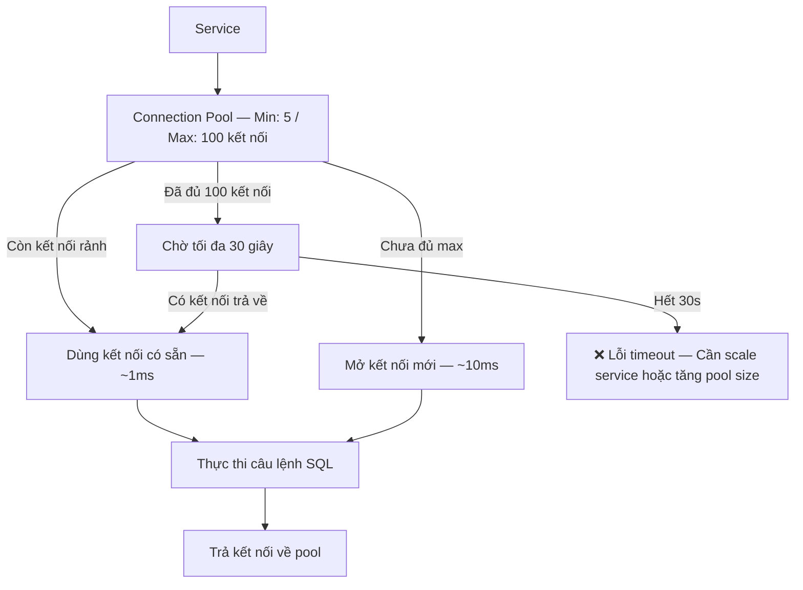
```mermaid
flowchart TD
    APP["Service"] --> POOL["Connection Pool — Min: 5 / Max: 100 kết nối"]

    POOL -->|"Còn kết nối rảnh"| REUSE["Dùng kết nối có sẵn — ~1ms"]
    POOL -->|"Chưa đủ max"| NEW["Mở kết nối mới — ~10ms"]
    POOL -->|"Đã đủ 100 kết nối"| WAIT["Chờ tối đa 30 giây"]
    WAIT -->|"Có kết nối trả về"| REUSE
    WAIT -->|"Hết 30s"| ERR["❌ Lỗi timeout — Cần scale service hoặc tăng pool size"]

    REUSE & NEW --> QUERY["Thực thi câu lệnh SQL"]
    QUERY --> RETURN["Trả kết nối về pool"]
```

### Chiến lược sao lưu

| Loại backup | Lịch | Lưu bao lâu |
|---|---|---|
| Full (toàn bộ) | Chủ Nhật 1:00 SA | 90 ngày |
| Differential (thay đổi) | Thứ 2–7 1:00 SA | 30 ngày |
| Transaction Log | Mỗi 4 tiếng | 7 ngày |

---

## 7. Cache — Redis

### Redis dùng để làm gì?

Redis là bộ nhớ đệm tốc độ cao. Thay vì mỗi yêu cầu phải truy vấn database (chậm), ta lưu kết quả vào Redis và lấy ra nhanh hơn nhiều.

| Mục đích | Key Redis | Hết hạn | Ai dùng |
|---|---|---|---|
| Cache cấu hình đối tác | `config:{id}` | 5 phút | Config Service |
| Chống trùng lặp yêu cầu | `idempotency:{key}` | 24 giờ | Integration Service |
| Khóa phân tán | `lock:{resource}` | 30 giây | Integration Service |
| Đếm rate limit | `ratelimit:{client}` | 1 phút | Gateway |

### Luồng cache — Lấy cấu hình đối tác

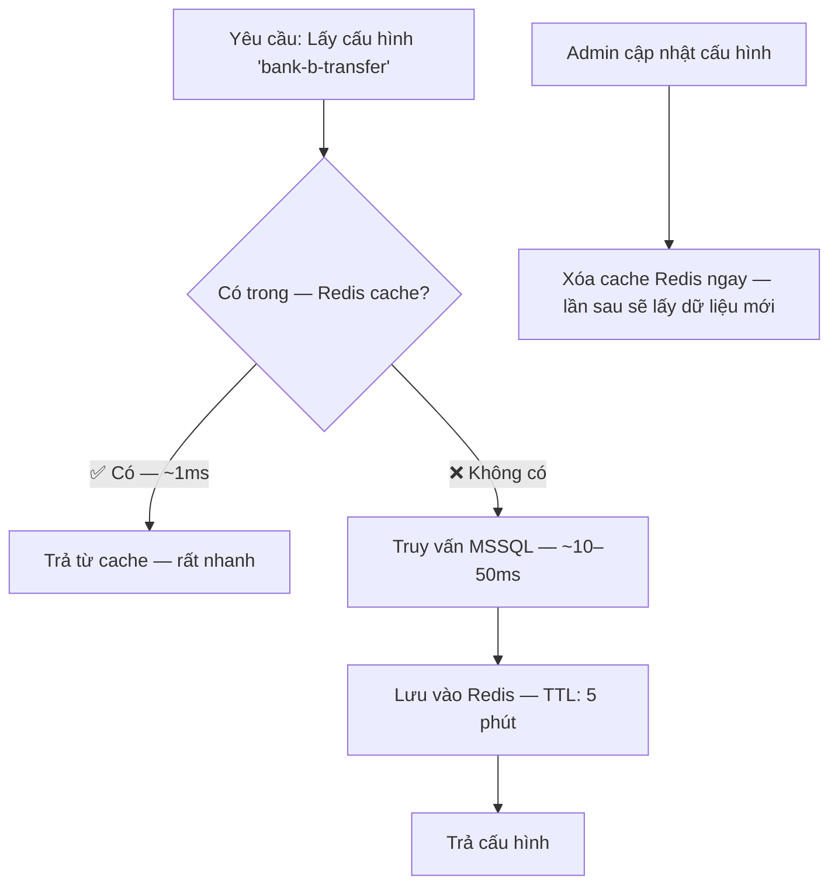
```mermaid
flowchart TD
    REQ["Yêu cầu: Lấy cấu hình 'bank-b-transfer'"]
    REQ --> CHECK{"Có trong — Redis cache?"}
    CHECK -->|"✅ Có — ~1ms"| HIT["Trả từ cache — rất nhanh"]
    CHECK -->|"❌ Không có"| MISS["Truy vấn MSSQL — ~10–50ms"]
    MISS --> SAVE["Lưu vào Redis — TTL: 5 phút"]
    SAVE --> RET["Trả cấu hình"]
    UPDATE["Admin cập nhật cấu hình"] --> DEL["Xóa cache Redis ngay — lần sau sẽ lấy dữ liệu mới"]
```

**Giải thích:** Cấu hình kết nối đối tác thay đổi rất ít. Nếu lưu vào cache 5 phút, hàng trăm yêu cầu trong 5 phút đó chỉ cần 1 lần truy vấn DB thật sự.

### Luồng chống trùng lặp (Idempotency)

> Đây là tính năng quan trọng — đảm bảo dù client gửi yêu cầu nhiều lần (do timeout, retry...) thì đối tác chỉ nhận 1 lần thật sự.

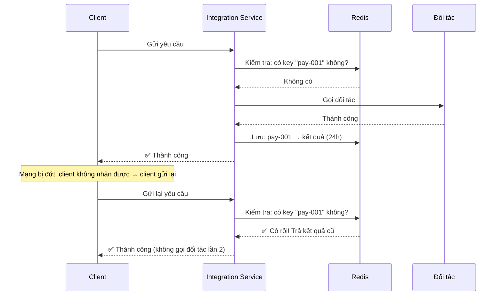
```mermaid
sequenceDiagram
    participant C as Client
    participant IS as Integration Service
    participant RD as Redis
    participant TP as Đối tác

    C->>IS: Gửi yêu cầu #1 Idempotency-Key: pay-001
    IS->>RD: Kiểm tra: có key "pay-001" không?
    RD-->>IS: Không có
    IS->>TP: Gọi đối tác
    TP-->>IS: Thành công
    IS->>RD: Lưu: pay-001 → kết quả (24h)
    IS-->>C: ✅ Thành công

    note over C: Mạng bị đứt, client không nhận được → client gửi lại

    C->>IS: Gửi lại yêu cầu #1 Idempotency-Key: pay-001
    IS->>RD: Kiểm tra: có key "pay-001" không?
    RD-->>IS: ✅ Có rồi! Trả kết quả cũ
    IS-->>C: ✅ Thành công (không gọi đối tác lần 2)
```

### Trạng thái Redis khi khởi động/phục hồi

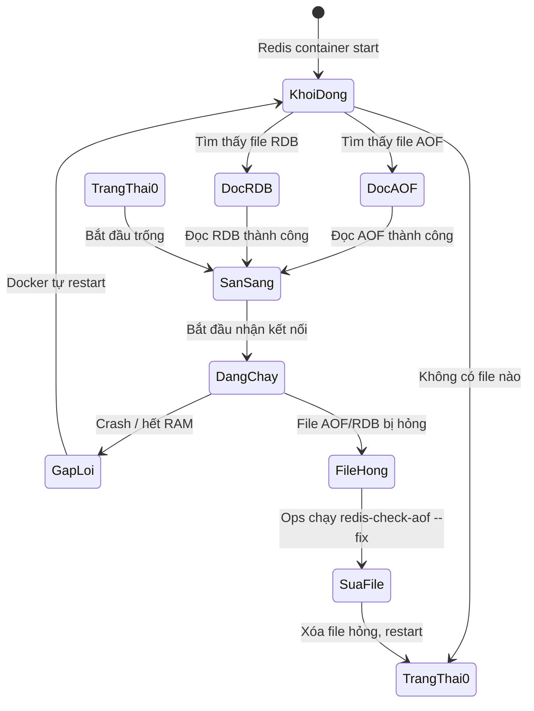
```mermaid
stateDiagram-v2
    [*] --> KhoiDong : Redis container start

    KhoiDong --> DocAOF  : Tìm thấy file AOF
    KhoiDong --> DocRDB  : Tìm thấy file RDB
    KhoiDong --> TrangThai0 : Không có file nào

    DocAOF --> SanSang : Đọc AOF thành công
    DocRDB --> SanSang : Đọc RDB thành công
    TrangChat0 --> SanSang : Bắt đầu trống

    SanSang --> DangChay : Bắt đầu nhận kết nối

    DangChay --> GapLoi : Crash / hết RAM
    GapLoi --> KhoiDong : Docker tự restart

    DangChay --> FileHong : File AOF/RDB bị hỏng
    FileHong --> SuaFile : Ops chạy redis-check-aof --fix
    SuaFile --> TrangThai0 : Xóa file hỏng, restart

    state "TrangThai0" as TrangChat0
    state "SanSang" as SanSang
```

> **ℹ️ Lưu ý:** Redis chỉ lưu cache — không lưu dữ liệu nghiệp vụ. Nếu Redis chết và khởi động lại, hệ thống vẫn hoạt động bình thường (chỉ chậm hơn vì phải truy vấn DB).

---

## 8. Giám sát & Cảnh báo

### Hệ thống giám sát gồm những gì?

| Công cụ | Dùng để làm gì | Địa chỉ truy cập |
|---|---|---|
| **Prometheus** | Thu thập số liệu từ các service | http://localhost:9090 |
| **Grafana** | Vẽ biểu đồ, thiết lập cảnh báo | http://localhost:3001 |
| **Jaeger** | Theo dõi một request đi qua những đâu | http://localhost:16686 |
| **Seq** | Tìm kiếm log theo nội dung | http://localhost:5341 |
| **RabbitMQ UI** | Xem trạng thái hàng đợi | http://localhost:15672 |

### Sơ đồ kiến trúc giám sát

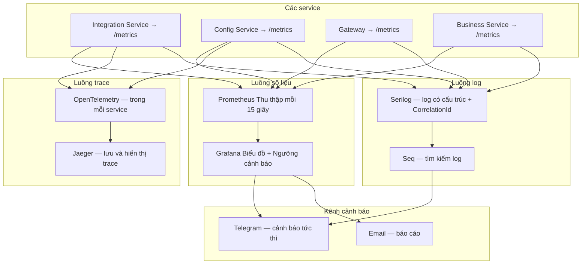
```mermaid
graph TD
    subgraph SVCS["Các service"]
        A["Integration Service → /metrics"]
        B["Config Service → /metrics"]
        C["Gateway → /metrics"]
        D["Business Service → /metrics"]
    end

    subgraph METRICS["Luồng số liệu"]
        PROM["Prometheus Thu thập mỗi 15 giây"]
        GRAF["Grafana Biểu đồ + Ngưỡng cảnh báo"]
    end

    subgraph TRACE["Luồng trace"]
        OTEL["OpenTelemetry — trong mỗi service"]
        JAE["Jaeger — lưu và hiển thị trace"]
    end

    subgraph LOGS["Luồng log"]
        SLOG["Serilog — log có cấu trúc + CorrelationId"]
        SEQ["Seq — tìm kiếm log"]
    end

    subgraph ALERT["Kênh cảnh báo"]
        TG2["Telegram — cảnh báo tức thì"]
        EMAIL["Email — báo cáo"]
    end

    A & B & C & D --> PROM
    PROM --> GRAF
    GRAF --> TG2 & EMAIL

    A & B --> OTEL --> JAE

    A & B & C & D --> SLOG --> SEQ
    SEQ --> TG2
```

### Luồng cảnh báo — Từ lỗi đến Telegram

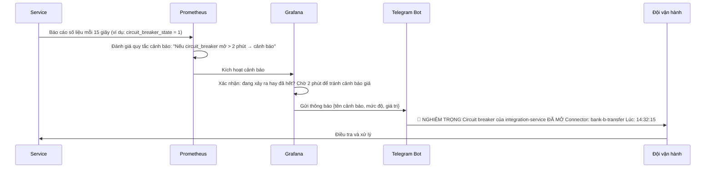
```mermaid
sequenceDiagram
    participant SVC as Service
    participant PROM as Prometheus
    participant GRAF as Grafana
    participant BOT as Telegram Bot
    participant OPS as Đội vận hành

    SVC->>PROM: Báo cáo số liệu mỗi 15 giây (ví dụ: circuit_breaker_state = 1)

    PROM->>PROM: Đánh giá quy tắc cảnh báo: "Nếu circuit_breaker mở > 2 phút → cảnh báo"

    PROM->>GRAF: Kích hoạt cảnh báo

    GRAF->>GRAF: Xác nhận: đang xảy ra hay đã hết? Chờ 2 phút để tránh cảnh báo giả

    GRAF->>BOT: Gửi thông báo {tên cảnh báo, mức độ, giá trị}

    BOT->>OPS: 🔴 NGHIÊM TRỌNG Circuit breaker của integration-service ĐÃ MỞ Connector: bank-b-transfer Lúc: 14:32:15

    OPS->>SVC: Điều tra và xử lý
```

### Theo dõi một request qua nhiều service (Distributed Tracing)

> Khi một yêu cầu đi qua nhiều service, Jaeger giúp ta thấy toàn bộ hành trình và mỗi bước mất bao nhiêu thời gian.

```mermaid
sequenceDiagram
    participant GW as Gateway
    participant IS as Integration Service
    participant CS as Config Service
    participant JA as Jaeger

    GW->>GW: Tạo TraceId: abc-123 Span: gw-001 (bắt đầu đếm giờ)
    GW->>IS: Gửi kèm traceparent: abc-123/gw-001
    IS->>IS: Tạo Span con: is-002
    IS->>CS: Gửi kèm traceparent: abc-123/is-002
    CS->>CS: Tạo Span con: cs-003

    IS-->>JA: Gửi dữ liệu span (nền)
    CS-->>JA: Gửi dữ liệu span (nền)
    GW-->>JA: Gửi dữ liệu span (nền)

    note over JA: Jaeger ghép lại thành cây: abc-123: Gateway 142ms   └─ Integration 98ms        └─ Config 44ms
```

### Các số liệu quan trọng cần theo dõi

| Số liệu | Cảnh báo vàng | Cảnh báo đỏ | Ý nghĩa |
|---|---|---|---|
| Tỷ lệ lỗi 5xx | > 1% | > 5% | Service đang gặp vấn đề |
| P99 latency | > 2 giây | > 5 giây | Service đang chậm |
| Queue depth (RabbitMQ) | > 500 | > 1000 | Tắc nghẽn xử lý |
| Redis memory | > 70% | > 90% | Sắp hết bộ nhớ cache |
| MSSQL connections | > 70/100 | > 90/100 | Quá nhiều kết nối DB |
| Disk usage | > 70% | > 85% | Sắp đầy ổ cứng |
| Circuit breaker | = HALF-OPEN | = OPEN | Đối tác đang có vấn đề |

---

## 9. CI/CD — Tự động hóa triển khai

### Quy tắc nhánh (Branch)

| Nhánh | Mục đích | Bảo vệ |
|---|---|---|
| `main` | Code sẵn sàng lên production | Cần 2 người review |
| `develop` | Tích hợp các tính năng đang phát triển | Cần 1 người review |
| `feature/*` | Phát triển tính năng mới | — |
| `hotfix/*` | Vá lỗi khẩn cấp trên production | Cần 1 người review |

### Sơ đồ CI/CD Pipeline

```mermaid
flowchart TD
    PUSH["Developer push code — lên develop hoặc main"] --> GH_TRIGGER["GitHub Actions tự động chạy"]

    GH_TRIGGER --> BE_BUILD["Build Backend — .NET restore + build + test"]
    GH_TRIGGER --> FE_BUILD["Build Frontend — npm install + build"]

    BE_BUILD --> BE_OK{"Test — qua không?"}
    FE_BUILD --> FE_OK{"Build — thành công?"}

    BE_OK -->|"Thất bại"| FAIL["Thông báo lỗi qua PR comment"]
    FE_OK -->|"Thất bại"| FAIL

    BE_OK -->|"Qua"| DOCKER_BUILD["Build 5 Docker Image song song — Tag: latest + git-sha"]
    FE_OK -->|"Qua"| DOCKER_BUILD

    DOCKER_BUILD --> PUSH_REG["Push lên Container Registry — ghcr.io/{org}/{service}:{sha}"]

    PUSH_REG --> STG["Deploy lên Staging — chỉ khi push vào main"]
    STG --> STG_HC{"Health — check?"}

    STG_HC -->|"Thất bại"| ROLLBACK_STG["Rollback Staging — Thông báo team"]
    STG_HC -->|"Ổn"| APPROVE["Chờ phê duyệt — trước khi lên Production"]

    APPROVE --> PROD["Deploy lên Production"]
    PROD --> PROD_HC{"Health — check?"}

    PROD_HC -->|"Thất bại"| ROLLBACK_PROD["Rollback Production — Cảnh báo Telegram ngay"]
    PROD_HC -->|"Ổn"| DONE["Deploy thành công — Thông báo team"]
```

### Rollback khi có sự cố

```bash
# Kubernetes — quay về version trước ngay lập tức
kubectl rollout undo deployment/integration-service -n integration-platform
kubectl rollout status deployment/integration-service   # Theo dõi tiến trình

# Docker Compose — kéo image của tag cụ thể
IMAGE_TAG=abc123def docker-compose up -d integration-service
```

---

## 10. Xử lý sự cố & Phục hồi

### Hệ thống tự bảo vệ như thế nào?

Mỗi lần gọi đối tác đều đi qua 4 lớp bảo vệ tự động:

```mermaid
flowchart LR
    REQ["Yêu cầu"] --> BH["Giới hạn đồng thời — Tối đa 20 request cùng lúc"]
    BH --> TO["Timeout — Hủy nếu chậm quá X giây"]
    TO --> RT["Tự thử lại — 3 lần: 1s → 2s → 4s"]
    RT --> CB["Circuit Breaker — Ngắt nếu lỗi quá nhiều"]
    CB --> TP["Đối tác ngoài — (Bank, SMS...)"]
```

### Circuit Breaker — Ngắt mạch tự động

> Circuit Breaker hoạt động giống cầu dao điện — khi lỗi quá nhiều, nó tự ngắt để bảo vệ hệ thống.

```mermaid
stateDiagram-v2
    [*] --> DongMach : Bắt đầu

    DongMach --> MoMach : Lỗi ≥ 50% trong 60 giây (ít nhất 10 lần gọi)

    MoMach --> NuaMo : Sau 30 giây tự thử lại

    NuaMo --> DongMach : 1 lần gọi thử thành công
    NuaMo --> MoMach : 1 lần gọi thử thất bại

    state DongMach {
        [*]: Hoạt động bình thường Tất cả yêu cầu đi qua
    }
    state MoMach {
        [*]: Ngắt hoàn toàn Trả lỗi ngay, không gọi đối tác → Tiết kiệm tài nguyên
    }
    state NuaMo {
        [*]: Cho 1 yêu cầu đi qua thử Để kiểm tra đối tác đã hồi phục chưa
    }
```

### Sơ đồ xử lý sự cố

```mermaid
flowchart TD
    ALERT["Nhận cảnh báo — Telegram hoặc Grafana"] --> DANHGIA{"Nguyên nhân — là gì?"}

    DANHGIA -->|"Service crash"| FIX1["docker logs ip-{service} — docker restart ip-{service} — curl /health"]
    DANHGIA -->|"Redis không phản hồi"| FIX2["redis-cli ping — Restart Redis — Cache tự rebuild từ DB"]
    DANHGIA -->|"DB không kết nối"| FIX3["Kiểm tra MSSQL container — Kiểm tra connection string — Restore từ backup nếu cần"]
    DANHGIA -->|"Queue tắc nghẽn"| FIX4["Xem RabbitMQ UI :15672 — Kiểm tra queue depth — Restart consumer service"]
    DANHGIA -->|"Circuit breaker mở"| FIX5["Kiểm tra đối tác — Chờ 30s tự phục hồi"]
    DANHGIA -->|"Ổ cứng đầy"| FIX6["docker system prune -f — Xóa log cũ > 30 ngày"]

    FIX1 & FIX2 & FIX3 & FIX4 & FIX5 & FIX6 --> VERIFY["Kiểm tra /health tất cả service — Xác nhận lỗi đã hết trong Grafana"]

    VERIFY --> KETQUA{"Đã giải — quyết?"}
    KETQUA -->|"Rồi"| PM["Viết báo cáo — Cập nhật runbook"]
    KETQUA -->|"Chưa"| ESC["Escalate lên senior / vendor"]
```

### Phục hồi Redis khi file bị hỏng

```bash
# 1. Tạm dừng service đang dùng Redis
docker stop ip-integration-service ip-config-service

# 2. Sao lưu file có thể hỏng (phòng trường hợp cần kiểm tra lại)
docker exec ip-redis cp /data/appendonly.aof /data/appendonly.aof.backup

# 3. Thử sửa tự động
docker exec ip-redis redis-check-aof --fix /data/appendonly.aof

# 4. Nếu không sửa được → xóa (an toàn vì Redis chỉ là cache)
docker exec ip-redis sh -c "rm -f /data/dump.rdb /data/appendonly.aof"
docker restart ip-redis
redis-cli -p 6380 ping   # Phải trả về: PONG

# 5. Khởi động lại các service — cache sẽ tự rebuild từ DB
docker start ip-config-service ip-integration-service
```

> **ℹ️ Tại sao an toàn để xóa Redis?** Redis chỉ lưu cache và key chống trùng lặp — không lưu dữ liệu gốc. Sau khi restart, service tự tải lại từ MSSQL.

### Bảng tra cứu lỗi nhanh

| Triệu chứng | Nguyên nhân thường gặp | Cách xử lý nhanh |
|---|---|---|
| Lỗi `INT_CFG_001` | Không tìm thấy `connectorConfigId` | Kiểm tra tên cấu hình, kiểm tra Config Service đang chạy |
| Lỗi `INT_CFG_002` | Cấu hình đang ở trạng thái inactive | Bật lại cấu hình trong Admin UI |
| Lỗi `INT_TMO_001` | Đối tác phản hồi quá chậm | Kiểm tra trạng thái đối tác, tăng `TimeoutMs` |
| Circuit breaker mở | Đối tác lỗi > 50% trong 60s | Chờ 30 giây tự phục hồi |
| Redis không phản hồi | Redis crash hoặc hết RAM | Khởi động lại Redis |
| Queue ngày càng nhiều | Consumer service bị dừng | Khởi động lại Integration Service |
| Lỗi 401 | JWT hết hạn | Làm mới token |

---

## 11. Mở rộng hệ thống

### Khi nào cần mở rộng?

Các service được thiết kế **stateless** (không lưu trạng thái cục bộ), nên có thể chạy nhiều bản song song.

```mermaid
graph TD
    subgraph LB2["Load Balancer"]
        LB3["Phân phối traffic vào các pod"]
    end

    subgraph PODS2["Các Pod — chạy song song"]
        I1["Integration Service Pod 1"]
        I2["Integration Service Pod 2"]
        I3["Integration Service Pod N (tự động thêm)"]
    end

    subgraph SHARED2["Trạng thái dùng chung"]
        R2["Redis — tất cả pod dùng chung"]
        M2["MSSQL — tất cả pod dùng chung"]
        Q2["RabbitMQ — tất cả pod dùng chung"]
    end

    LB3 --> I1 & I2 & I3
    I1 & I2 & I3 --> R2 & M2 & Q2
```

**Tại sao có thể chạy nhiều pod?** Vì cache và idempotency đều lưu trên Redis dùng chung — dù pod nào xử lý request cũng truy cập cùng một Redis.

### Kubernetes tự động scale

```yaml
# Cấu hình tự động scale Integration Service
minReplicas: 2    # Luôn có ít nhất 2 pod
maxReplicas: 10   # Tối đa 10 pod
# Tự động thêm pod khi CPU > 70% hoặc RAM > 80%
```

### Giới hạn khi scale

| Service | Có thể scale ngang? | Lưu ý |
|---|---|---|
| Gateway | ✅ Dễ dàng | Không lưu trạng thái |
| Integration Service | ✅ Dễ dàng | Idempotency lưu trên Redis chung |
| Config Service | ✅ Dễ dàng | Config cache trên Redis chung |
| Business Service | ✅ Dễ dàng | Không lưu trạng thái |
| WebSocket Service | ⚠️ Cần cấu hình thêm | Cần Redis backplane cho SignalR |
| Redis | ❌ Scale khác | Dùng Redis Cluster |
| MSSQL | ❌ Scale khác | Thêm read replica cho đọc |
| RabbitMQ | ❌ Scale khác | Cấu hình RabbitMQ Cluster |

---

## 12. Bảo mật

### Các lớp bảo vệ

```mermaid
graph TD
    INTERNET2["Internet"] -->|"HTTPS"| TLS2["TLS / SSL — nginx hoặc Cloud LB"]

    TLS2 -->|"HTTP nội bộ"| GW2["API Gateway — Kiểm tra JWT — Giới hạn request/giây — Ghi log"]

    GW2 --> INTERNAL2

    subgraph INTERNAL2["Mạng nội bộ — không ra internet"]
        IS2["Integration Service"]
        CS2B["Config Service"]
        DB2["MSSQL — không có cổng public"]
        RD2["Redis — không có cổng public"]
    end
```

### Danh sách bảo mật đã áp dụng

| Hạng mục | Cách thực hiện | Trạng thái |
|---|---|---|
| HTTPS / TLS | Tại nginx hoặc Cloud LB | ✅ Bắt buộc ở production |
| Xác thực JWT | Kiểm tra tại Gateway trước khi chuyển tiếp | ✅ |
| Container không chạy root | `USER appuser` trong Dockerfile | ✅ |
| Mật khẩu không lưu trong code | Dùng K8s Secrets / biến môi trường | ✅ |
| Kiểm tra dữ liệu đầu vào | `MappingEngine.Validate()` ở tầng Application | ✅ |
| Chống SQL injection | EF Core dùng parameterized query | ✅ (by framework) |
| Cách ly mạng nội bộ | Docker bridge network / K8s namespace | ✅ |
| Log mọi giao dịch | Mỗi lần gọi đối tác → ghi `ExecutionLog` | ✅ |
| Chống trùng lặp | Idempotency key + Redis 24h | ✅ |

> **⚠️ Quan trọng:** Không bao giờ đặt mật khẩu trong file `appsettings.Production.json`, Dockerfile, hay docker-compose.yml. Luôn dùng biến môi trường hoặc K8s Secrets.

---

## 13. Disaster Recovery

### Mục tiêu phục hồi

| Tình huống | Phục hồi trong | Mất dữ liệu tối đa | Ưu tiên |
|---|---|---|---|
| Service bị crash | < 1 phút (tự động restart) | Không | P1 |
| Redis hỏng | < 5 phút | < 1 phút (AOF) | P2 |
| MSSQL bị hỏng | < 4 giờ | < 4 giờ | P1 |
| Cả máy chủ hỏng | < 30 phút | < 24 giờ | P1 |
| Cả data center hỏng | < 2 giờ | < 24 giờ | P0 |

### Sơ đồ phục hồi sau thảm họa

```mermaid
flowchart TD
    D["Thảm họa xảy ra — Máy chủ / Data center hỏng"] --> N["Thông báo stakeholders — Kích hoạt kế hoạch DR"]

    N --> S1["Bước 1 — Chuẩn bị hạ tầng — Tạo máy chủ mới hoặc K8s cluster"]
    S1 --> S2["Bước 2 — Khôi phục MSSQL — Restore: Full → Differential → Log"]
    S2 --> S3["Bước 3 — Khởi động Redis — Bắt đầu trống, cache tự rebuild"]
    S3 --> S4["Bước 4 — Deploy services — Pull image từ registry, apply secrets"]
    S4 --> S5["Bước 5 — Smoke test — /health + 1 giao dịch thật + RabbitMQ"]
    S5 --> S6["Bước 6 — Chuyển DNS — Trỏ api.company.com về IP mới"]
    S6 --> S7["Bước 7 — Theo dõi 1 giờ — Error rate + circuit breaker + queue"]
    S7 --> DONE2["Phục hồi hoàn tất — Viết báo cáo sự cố"]
```

### Lịch sao lưu

| Loại | Lịch | Lưu trữ | Thời gian giữ |
|---|---|---|---|
| MSSQL Full | Chủ nhật 1:00 SA | Cold storage | 90 ngày |
| MSSQL Differential | Thứ 2–7 1:00 SA | Warm storage | 30 ngày |
| MSSQL Transaction Log | Mỗi 4 tiếng | Warm storage | 7 ngày |
| Redis RDB | Mỗi ngày (tự động) | Cùng volume | 7 ngày |
| Cấu hình connector | Mỗi lần thay đổi | Git repository | Vĩnh viễn |
| Docker images | Mỗi lần merge vào main | Container registry | Tất cả version |

---

## 14. Runbook vận hành

### ✅ Checklist trước khi deploy

```
PRE-DEPLOY
□ Tất cả test đã pass
□ Code review đã được phê duyệt (≥2 người cho main)
□ Docker images đã build và push lên registry
□ Script migration DB đã review (backward compatible)
□ Đã xác nhận kế hoạch rollback
□ Đã thông báo team qua Slack/Telegram

DEPLOY (theo đúng thứ tự)
□ Chạy migration DB trước
□ Deploy config-service → chờ healthy
□ Deploy integration-service → chờ healthy, kiểm tra circuit breaker
□ Deploy business-service + websocket-service
□ Deploy gateway
□ Deploy admin-ui
□ Chạy smoke test: gọi 1 giao dịch thật
□ Theo dõi 15 phút: lỗi < 1%, P99 < 2s

POST-DEPLOY
□ Cập nhật CHANGELOG.md
□ Đóng ticket
□ Thông báo kết quả
```

### 🔄 Thứ tự khởi động lại hệ thống

```bash
# Bước 1: Khởi động hạ tầng trước
docker-compose up -d sqlserver redis rabbitmq
# Chờ tất cả báo "healthy"
docker-compose ps

# Bước 2: Khởi động các service theo thứ tự
docker-compose up -d config-service
docker-compose up -d integration-service business-service websocket-service
docker-compose up -d gateway admin-ui

# Kubernetes: rolling restart không gián đoạn
kubectl rollout restart deployment/integration-service -n integration-platform
kubectl rollout status deployment/integration-service
```

### 📊 Checklist giám sát hàng ngày

```
MỖI BUỔI SÁNG
□ Grafana: tỷ lệ lỗi < 1%, P99 < 2s
□ RabbitMQ :15672: queue depth ≈ 0
□ Prometheus: không có cảnh báo đang kích hoạt
□ Seq: không có lỗi ERROR/CRITICAL trong 24h qua
□ Circuit breaker: tất cả ở trạng thái CLOSED

MỖI TUẦN
□ Xu hướng trên Grafana: RAM hoặc CPU có tăng dần không?
□ Dung lượng ổ đĩa: docker system df — phải < 70%
□ Xác nhận file backup tồn tại và không rỗng
□ Thử restore 1 lần trên môi trường staging
□ Kiểm tra sức khỏe connector: GET /api/integration/health/{configId}
```

### 🚨 Xử lý sự cố khẩn cấp

```
MỨC ĐỘ SỰ CỐ
P1 — Nghiêm trọng: Hệ thống ngừng, mất dữ liệu → Phản hồi trong 15 phút
P2 — Lớn: Giảm hiệu suất, một phần bị ảnh hưởng → Phản hồi trong 1 giờ
P3 — Nhỏ: 1 connector lỗi, tính năng phụ bị hỏng → Phản hồi trong 4 giờ

CÁC BƯỚC XỬ LÝ
1. Xác nhận nhận được cảnh báo trong Telegram/Slack
2. Đánh giá phạm vi ảnh hưởng (ai/service nào bị ảnh hưởng)
3. Kiểm tra trạng thái service:
   docker ps
   kubectl get pods -n integration-platform
4. Xem log (tìm theo CorrelationId):
   docker logs --tail=200 ip-integration-service | grep <correlationId>
5. Nếu 15 phút chưa giải quyết → báo cáo senior

SAU KHI GIẢI QUYẾT
□ Tất cả /health endpoint đã green
□ Tỷ lệ lỗi đã bình thường trên Grafana
□ Viết báo cáo: Gì / Khi nào / Tại sao / Cách sửa / Phòng ngừa
□ Cập nhật runbook nếu gặp tình huống mới
□ Tạo ticket cho cách sửa lâu dài
```

---

## 📚 Tài liệu tham khảo

| Tài liệu | Địa chỉ |
|---|---|
| Swagger API (dev) | http://localhost:5001/swagger |
| RabbitMQ Management | http://localhost:15672 (admin/admin) |
| Grafana Dashboard | http://localhost:3001 (admin/admin) |
| Jaeger Tracing | http://localhost:16686 |
| Kiến trúc chi tiết | `docs/architecture.md` |
| Hướng dẫn deploy | `docs/deployment-guide.md` |
| Luồng tích hợp chi tiết | `docs/integration-flow-detail.md` |
| Postman Collection | `docs/postman-collection.json` |
| Hướng dẫn chạy local | `docs/run-guide.md` |
| Hướng dẫn test | `docs/test-guide.md` |
| Ví dụ cấu hình connector | `docs/config-examples/` |

---

## 🏷️ Lịch sử cập nhật

| Phiên bản | Ngày | Thay đổi |
|---|---|---|
| 2.1.0 | 2026-05-21 | Viết lại tiếng Việt, ưu tiên diagram, dễ onboarding |
| 2.0.0 | 2026-05-21 | Refactor toàn bộ, thêm System Overview, giải thích routing |
| 1.0.0 | 2026-05-21 | Tạo tài liệu lần đầu |

---

> **📌 Ghi chú cho người maintain:** Cập nhật tài liệu này mỗi khi thêm service mới, thay đổi kiến trúc, hoặc cập nhật quy trình triển khai. Xem lại định kỳ hàng tháng trong sprint retrospective.
